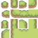
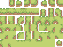

# THIS IS AN EXPERIMENTAL AND NON WORKING EXTENSION - IGNORE!

# extension-autotiling

This is an extension for applying 4- or 8-bit autotiling while painting on a Defold tilemap. The extension uses the solution described in this blog post:

https://gamedevelopment.tutsplus.com/tutorials/how-to-use-tile-bitmasking-to-auto-tile-your-level-layouts--cms-25673

## Usage

1. Create a tilesource and arrange the tiles to either accommodate 4 or 8-bit autotiling:

	4-bit autotiling tilesource:

	

	8-bit autotiling tilesource:

	

2. Create a tilemap and assign the tilesource.

3. Prefix the tilemap layer name with either `-auto4bit` or `-auto8bit` to tell the plugin to apply autotiling to any tile painted in the layer. Note that all layers must use the same prefix and the prefix must of course match the type of tilesource for the plugin to work properly.

## Example
Open this extension as a Defold project and run it. Select the tilemap and start painting with any tile from the palette. The autotiling algorithm will automatically pick the correct tiles to paint, based on surrounding tiles.

